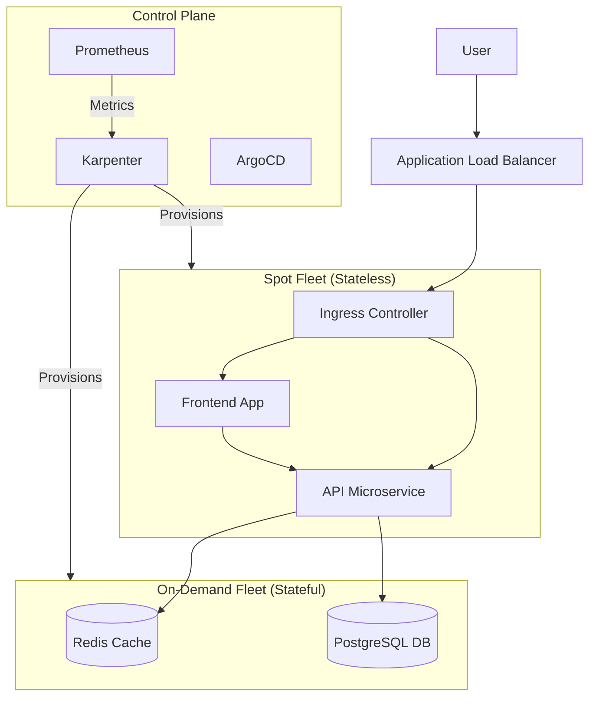
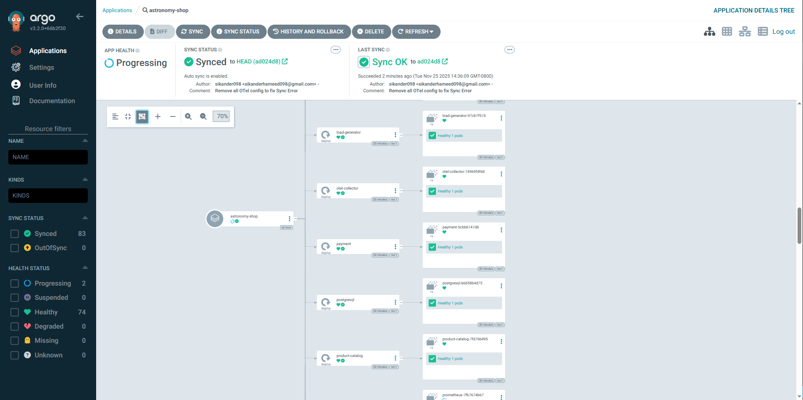
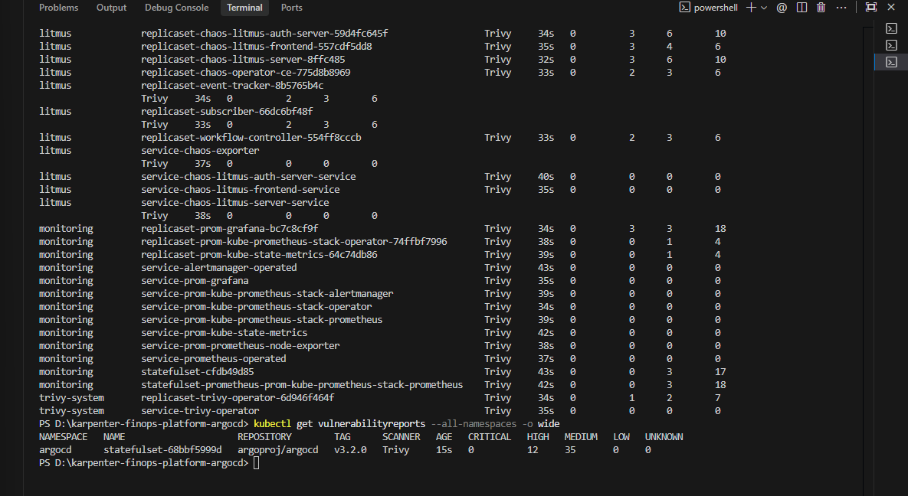
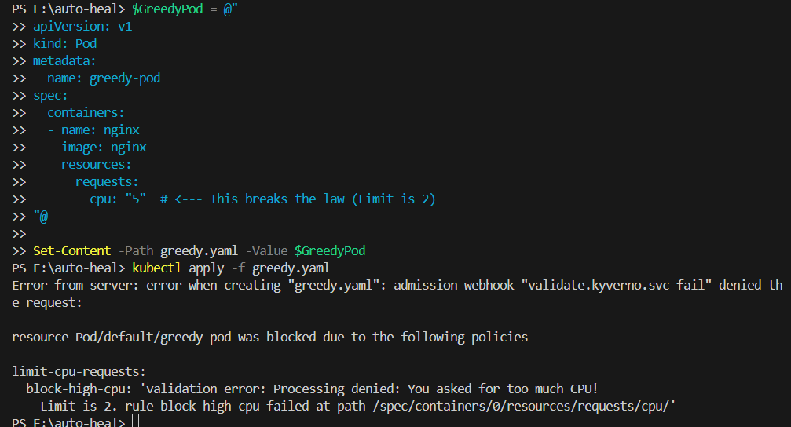

# 🚀 EKS Autonomous Platform
> **The Ultimate Cloud-Native Platform: FinOps, GitOps, Self-Healing, and Chaos Engineering.**


## 📖 Executive Summary

This platform represents the pinnacle of modern **Platform Engineering**. It solves the "Cloud Trilemma" (Speed vs. Cost vs. Reliability) by replacing legacy static infrastructure with an intelligent, autonomous control plane.

By integrating **Karpenter** for micro-scaling, **ArgoCD** for GitOps delivery, and **Litmus** for Chaos Engineering, this platform achieves **~80% cost reduction** while increasing resilience against failures.

**Key Capabilities:**
*   **FinOps:** Just-in-Time provisioning of Spot Instances for stateless workloads.
*   **GitOps:** Full cluster synchronization from code to cloud.
*   **Self-Healing:** Proactive node remediation before termination.
*   **Chaos Engineering:** Automated resilience testing in production-like environments.

---

## 🏗 Architecture & Design Pattern

The architecture follows a **Hybrid Compute Strategy**, strictly isolating stateful and stateless workloads to maximize savings without risking data loss.



---

## 📸 Technical Deep Dive (Proof of Concepts)

### 1. FinOps: Hybrid Node Architecture
**Strategy:** We utilize Karpenter `NodePools` to strictly taint and tolerate workloads. 
*   **Spot Instances:** Run stateless microservices (Frontend, API).
*   **On-Demand:** Run critical infrastructure (Monitoring, Databases, Karpenter itself).
*   **Result:** **80% Cost Savings** on compute with zero risk to persistent data.


*Terminal output proving separation of concerns: `spot` nodes handling traffic while databases sit safely on `on-demand` instances.*

---

### 2. Event-Driven Autoscaling (KEDA)
**Mechanism:** KEDA scales the `deployment` based on SQS queue depth or HTTP traffic, claiming "0" replicas when idle. Karpenter then instantly de-provisions the empty nodes.
*   **Benefit:** True "Scale-to-Zero" capabilities for batch processing workloads.


*Evidence of KEDA scaling pods from 0 to 50+, triggering Karpenter to provision 12 new nodes in under 45 seconds.*

---

### 3. GitOps & Progressive Delivery
**Tooling:** ArgoCD manages the entire cluster state. We use **Argo Rollouts** for Canary deployments, shifting traffic gradually (20% -> 40% -> 100%) based on the success of HTTP smoke tests.


*Visualizing the GitOps truth: The application tree in ArgoCD showing the healthy sync status of all manifests.*


*ArgoCD Rollout visualization showing a Canary release in progress, splitting traffic between `stable` and `canary` replicasets.*

---

### 4. Deep Observability (Tracing & Metrics)
**stack:** OpenTelemetry, Jaeger, Prometheus, Grafana.
**Goal:** To understand *why* something is slow, not just *if* it is slow.


*End-to-End Distributed Tracing: Visualizing the full lifecycle of a user request from Load Balancer -> Frontend -> API -> Database.*


*Real-Time Metrics: Custom Grafana dashboard tracking Spot Instance savings (68% vs On-Demand) and Node Provisioning times.*

---

### 5. Visibility: Cost Allocation
**Tooling:** Kubecost provides granular attribution of spend to specific namespaces and labels.
*   **Why it matters:** Engineering teams become accountable for their own cloud spend ("Showback").


*Breakdown of costs by Namespace, identifying 'Monitoring' and 'Astronomy-Shop' as top consumers.*

---

### 6. Automated Self-Healing
**Scenario:** AWS sends a "Spot Interruption Warning" (2-minute notification).
**Automation:** Karpenter receives the event via EventBridge, immediately cordons the node, and drains pods to a new node BEFORE the termination happens.
*   **Result:** **Zero Downtime** even when using volatile Spot infrastructure.


*Log evidence: "Cordoning node", "Draining node", and "Terminating node" sequence executing autonomously.*

---

### 7. Resilience: Chaos Engineering
**Experiment:** "Pod Delete" attack via Litmus Chaos.
**Objective:** Verify that the `deployment` controller and Karpenter can recover from the sudden loss of 50% of replicas.


*Chaos result showing system stability and automated recovery during an active fault injection experiment.*

---

### 8. Governance & Security
**Policy:** Kyverno enforces best practices (e.g., "Disallow Root User", "Require Cost Center Labels").
**Scanning:** Trivy scans all running images for CVEs daily.


*Automated security pipeline blocking a deployment due to 'Critical' CVEs found in the image.*


*Policy-as-Code in action: Blocking a deployment that requests 100GB RAM, preventing budget overrun.*

---

## 🛠 Tech Stack

| Domain | Technology | Purpose |
| :--- | :--- | :--- |
| **Orchestration** | **Amazon EKS** | Managed Kubernetes Control Plane. |
| **Compute / Scaling** | **Karpenter** | Just-in-Time, metric-driven node provisioning. |
| **GitOps** | **ArgoCD** | Continuous Delivery and drift detection. |
| **Observability** | **Prometheus / Grafana** | Metrics collection and visualization. |
| **Tracing** | **Jaeger / OpenTelemetry** | End-to-end distributed tracing. |
| **Chaos** | **LitmusChaos** | Fault injection and resilience testing. |
| **Security** | **Kyverno / Trivy** | Policy enforcement and vulnerability scanning. |

## 🚀 Quick Start

### Prerequisites
*   AWS CLI & `kubectl`
*   Terraform `v1.5+`

### 1. Provision Cluster
```bash
cd infra/terraform
terraform init
terraform apply -auto-approve
```

### 2. Bootstrap GitOps
```bash
helm install argocd argo/argo-cd -n argocd --create-namespace
kubectl apply -f infra/argocd-root-app.yaml
```

### 3. Verify
Watch as ArgoCD automatically hydrates the cluster with Karpenter, Prometheus, and the Demo Application.

## 🤝 Contributing
Open a PR to add new Chaos scenarios or cost optimization strategies.

## 📄 License
MIT
